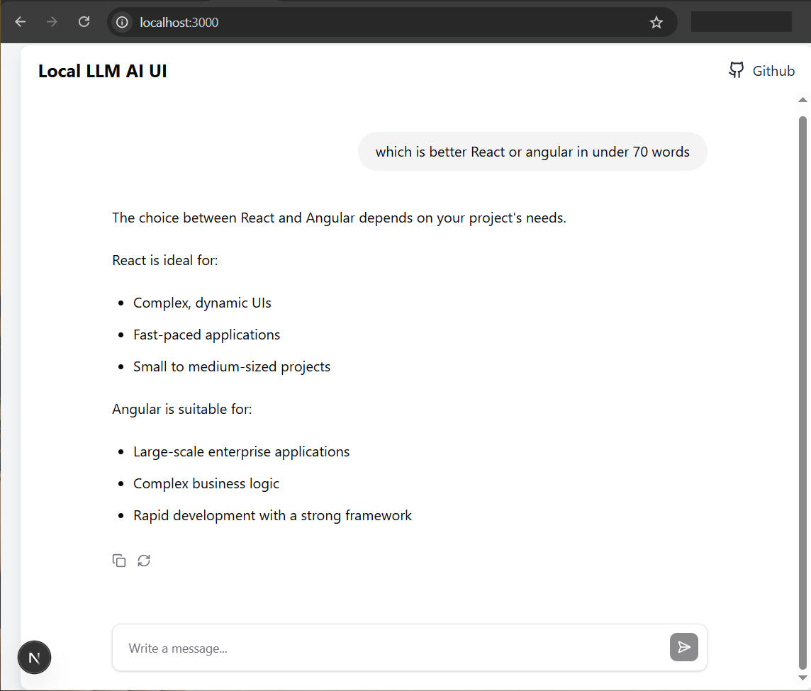

# 🧠 LLM on Local + AI-UI

Hey there!
This project is brought to you by [dhbalaji](https://dhbalaji.dev) — someone who lives and breathes AI for frontend use cases. If you love building beautiful interfaces *and* want to get your hands dirty with cutting-edge local LLMs, you’re in the right place. 🍿

---

## 🚀 What’s This All About?

The motivation behind this repo is simple:

> *Run your own LLM-powered AI apps on your local machine — just like the good old days of LAMP or MERN stacks.*

Forget SaaS-based APIs with rate limits, latency, and vendor lock-ins. We're talking *local-first, open-source-powered, developer-friendly* setup for building AI-powered UIs.

This project is still very much a work-in-progress (WIP), but it already has some solid foundations that aren’t going anywhere.



---

## 🧩 The Building Blocks

### 1. 🦙 Ollama – Your Local LLM Engine

If you haven't checked out [Ollama](https://ollama.com/), do it now.

It’s basically the Docker for LLMs — download a model, spin it up locally, and start chatting.

```bash
ollama run llama3.2
```

That’s it. You now have a local LLM running on your machine.
No GPU? No problem. It handles quantized models like a champ.

I’m currently using `llama3.2`, which serves as the default model in this setup. Make sure your app always points to the same model name, unless you switch things up.

---

### 2. 💬 Assistant UI – Gorgeous Frontend for Chat UIs

This one’s for the frontend nerds (like me).

[Assistant UI](https://www.assistant-ui.com/) is a beautiful, modular, and highly reactive set of React components for building chat interfaces. Think of it as the UI layer of ChatGPT — but open-source and developer-friendly.

As a frontend architect, I love the architecture here:

* **Optimistic UI** out of the box
* Works with streaming responses
* Easily customizable themes
* React + Tailwind goodness

This repo wires up Assistant UI as the frontend layer talking to our local Ollama backend. Clean, reactive, and modern — the way frontend should be in 2025.

---

### 3. ⚙️ Next.js 15 – The Backbone

We’re using [Next.js 15](https://nextjs.org/) as the application framework. Honestly, if you’re building React apps in 2025 and *not* using Next.js, you’re probably on a sabbatical or coding in a cave 🏕️.

Why Next.js?

* File-based routing
* SSR for faster initial loads
* App Router for better DX
* Built-in support for edge functions and streaming

This repo uses the app directory structure and embraces all the good parts of Next 15.

---

## 🛠️ Dev Setup

Clone the repo and fire it up locally:

```bash
git clone https://github.com/your-username/llm-local-ai-ui.git
cd llm-local-ai-ui
npm install
npm dev
```

Make sure you’ve got `ollama` running with the model you want:

```bash
ollama run llama3.2
```

---

## 📦 What’s Coming Next?

* 🔄 Support for system instructions
* 🧠 Agent mode (planning + tool use)
* ✨ Chat history + persistence
* 🌐 Embeddings + retrieval (RAG-style)
* ⚡ WebSocket streaming

---

## 👨‍💻 Who Should Use This?

* Frontend engineers who want to build with AI without going broke on API costs
* Indie hackers looking for ChatGPT-style apps that work offline
* Devs who want full control over LLM behavior + data privacy

If you’ve ever wanted a *self-hosted ChatGPT UI*, this is it.

---

## 📣 Shoutouts

* [Ollama](https://ollama.com/) for democratizing local LLMs
* [Assistant UI](https://assistant-ui.com/) for that clean UI
* Open-source heroes keeping dev life awesome

---

## 📬 Wanna Contribute?

Fork it, clone it, and drop a PR.
Feature ideas, bug fixes, or even just fixing a typo — it all counts.

---

## 🧘 Final Words

The future of frontend is *AI-first*.
This repo is where they meet.

Stay tuned. More magic coming soon. ✨
